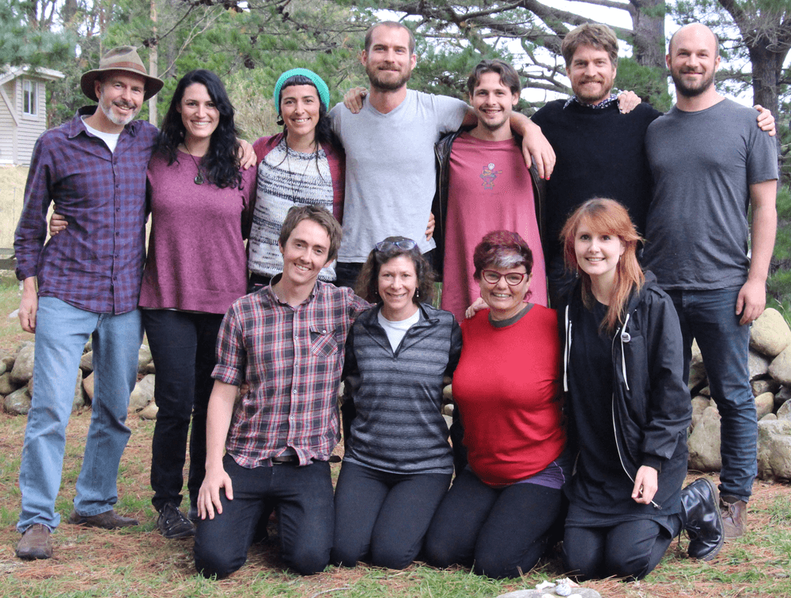

## Loomio Co-op Handbook

We build software for collaborative decision making, used by thousands of organisations and communities around the world.

If you’re looking for a way to make group decisions without meeting, 
try it out at [loomio.org](http://www.loomio.org).

The software we build is [open source](http://github.com/loomio/loomio), which means we freely share the code for anyone to read, learn from, and modify.

Our organisation is open source too. If you want to learn how we run an efficient organisation without a hierarchy, this handbook is good place to start.

Our coop shares the [seven cooperative principles](http://faresharecoop.org/why-be-a-co-op.html). 

Want to know more? For related stories, check the [Loomio blog](http://blog.loomio.org/category/articles-and-interviews/) and the [Enspiral Blog](http://blog.enspiral.com). 
You can find out [about us](http://loomio.org/about), or [get in touch](https://www.loomio.org/contact)!

The Loomio Cooperative is based in Aotearoa New Zealand.

This work is licensed under a [Creative Commons Attribution-ShareAlike 4.0 Unported License](http://creativecommons.org/licenses/by-sa/4.0/).
