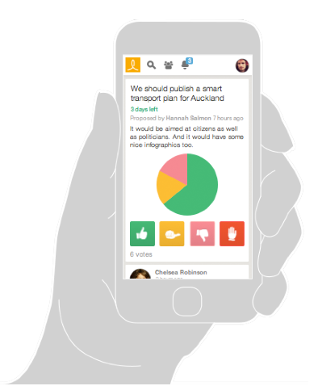

## Loomio Co-op Handbook

We build software for collaborative decision making, used by thousands of organisations and communities around the world. If you’re looking for a way to make group decisions without meeting, try it out at [loomio.org](http://www.loomio.org).

The software we build is [open source](http://github.com/loomio/loomio), which means we freely share the code for anyone to read, learn from, and modify. Our organisation is open source too. If you want to learn how we run an efficient organisation without a hierarchy, this handbook is good place to start.

The Loomio Cooperative is based in Aotearoa New Zealand.

## About this handbook

This work is licensed under a [Creative Commons Attribution-ShareAlike 4.0 Unported License](http://creativecommons.org/licenses/by-sa/4.0/).

If you find it helpful, please [let us know](https://loomio.org/contact). We'd love to hear from you. 🐌

You can find the code [on Github](github.com/loomio/loomio-coop-handbook), and download the handbook in different formats [from Gitbooks](https://www.gitbook.com/book/loomio/loomio-cooperative-handbook/details).