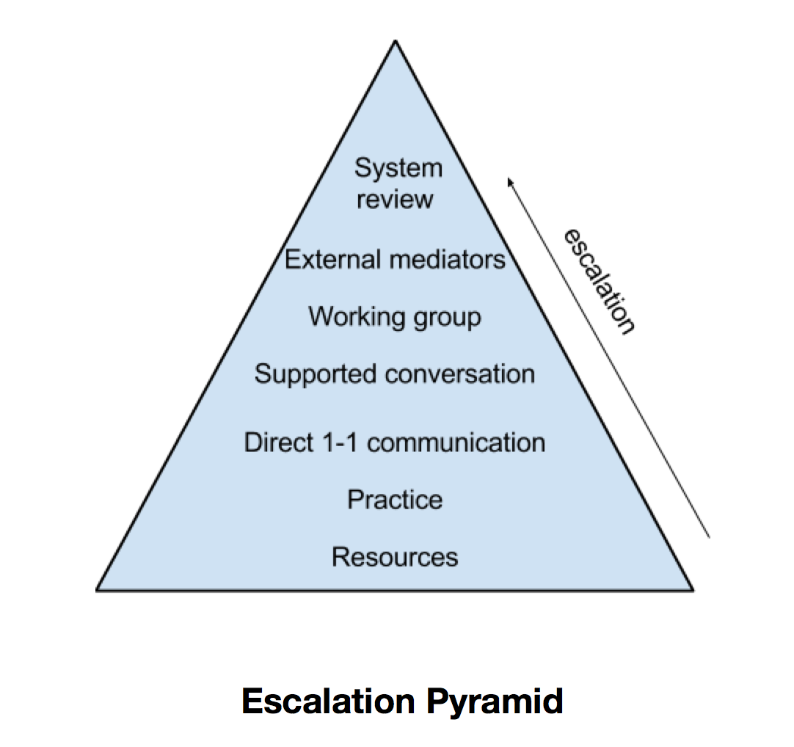

# Conflict Resolution

At Loomio we want to do conflict well. We want tensions between team members to be generative, healthy and productive. We want a culture of robust debate, honesty, and care - all in service of our mission.

###Principles
* Resolve conflicts as close as possible to the people involved. Begin with the people directly involved, and escalate from there as needed.
* We have mutual responsibility and care for each other. We act in good faith and work to be constructive, empathetic, and honest. We resolve conflicts with both our individual needs and the needs of the cooperative in mind.
* When disagreement becomes conflicted and is blocking progress, is hurtful or harmful, a resolution needs to be found. We engage to the best of our ability to resolve conflict, and seek help when needed.
* Anyone affected by a conflict can escalate an issue that is not being resolved at the current level of engagement.
* Resolution means the parties involved feel heard, the agreed outcome or change is clear, and normal decision-making and activity within Loomio is possible. If a conflict continues to negatively impact an individual or the team, it is not resolved.
* Loomio employer–employee relationships are covered by the [minimum employment rights](http://employment.govt.nz/er/minimumrights/index.asp) guaranteed by New Zealand law. This includes the requirement that employers and employees deal with each other in [‘good faith’](http://employment.govt.nz/er/solvingproblems/keyprinciples/goodfaith.asp).

###Organisational Resources
*how we equip ourselves to approach a breakdown in communication productively*

Resources are for everyone to access and use to take responsibility for our own behaviour and also to support others with theirs.

* Well Working group
* The Loomio Cooperative Handbook
* The stewardship system
* The sprint process (retrospectives, etc)
* The coordinators
* Professional development
* Retreats and team building opportunities
* Expert mediators or advisors

###Practice 
*how we encourage effective communication within our organisation*

* An introduction to our communication systems, culture and conflict resolution process are part of our staff onboarding.
* Regular team processes to reflect on our systems and raise any issues, such as sprint standups and retrospectives, check-in rounds at meetings.
* Prompts in stewardship sessions to work through any conflicts or problems between individuals, or between an individual and the cooperative as a whole.
* Continuous focus on smooth, effective, empathetic communication online and offline within the team. A culture of giving direct constructive feedback, listening to one another, and asking for help when needed.

###Conflict Resolution Process
We endeavour to resolve conflicts at the lowest possible escalation step, but agree to escalate conflicts if they are not resolved.

1. Personal reflection & individual support
Think through what happened. Take time and space to process and clarify your thinking if you feel confused, overwhelmed, or are experiencing strong emotions. Talk to a trusted friend, colleague, or your steward to work through your own perspective and experience. Ask yourself what part you played in it, what you could have done different, and what your needs are to improve the situation. If you feel you need to go beyond individual work to resolve the problem, escalate to the next step.

2. Direct communication
As long as you feel safe and the power balance and tone is conducive to constructive discussion, approach the person in question and talk it out. Be mindful of picking a good time and place (privacy, lack of time pressure, mutually agreed location). If you don’t feel like you can work it out one-on-one for any reason, escalate to the next step.

3. Supported communication
Bring in your steward to host a conversation with the people involved. The other party might want to bring their steward, too. If the stewards feel insufficiently resourced, or you’ve tried and it didn’t resolve the conflict, escalate to the next step.

4. Well Working Group 
If the previous steps have not resolved the conflict, reach out to the Well Working Group, or ask your steward to do so. They will try to find a mutually agreeable next step, such as hosting a mediation themselves, or inviting an external mediator or other expert in.

If the above steps are not successful in resolving the conflict, the situation will be escalated beyond the conflict resolution process and become an employment matter. At this stage, the coordinators will be engaged to gather all the information about the situation and figure out next steps. Irresolvable conflicts may lead to someone leaving the organisation, referral to external authorities if relevant, or systemic/structural changes to our organisation.

###Engaging the Conflict Resolution Process
* The board may ask people to engage in a conflict resolution process (see clause 11.4.3 of the [Constitution](constitution.html)).
* If there is tension between you and another worker, you can engage the Conflict Resolution Process, starting with the first stage: Personal reflection & individual support.
* If you notice conflict between other workers that doesn’t seem to be on the path to resolution, you should feel empowered to draw their attention to it, and suggest they engage the Conflict Resolution Process if necessary. Alternatively, you could let their steward or the Well Working Group know.

Additional Resources on conflict resolution and communication to promote shared understanding [can be found here](conflict_resolution_resources.html).

