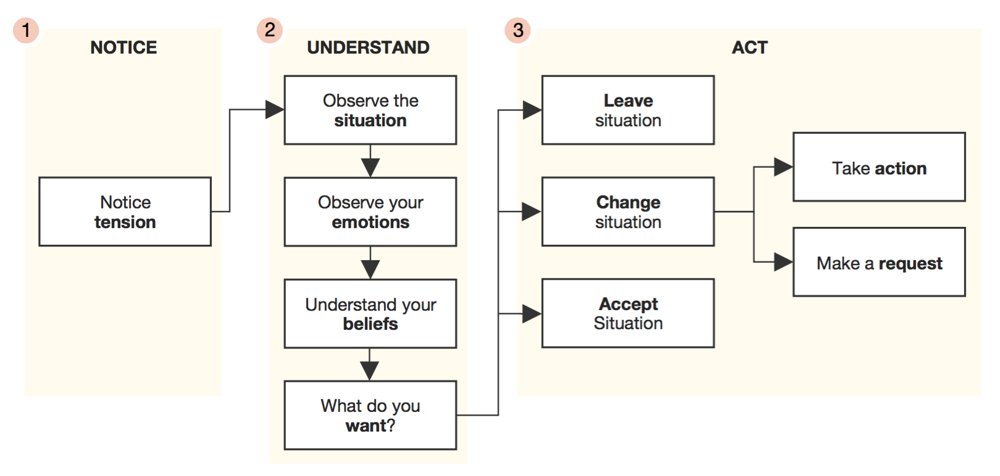

# Conflict Resolution Resources
These resources and guidelines may help prevent, process, or resolve conflict, and can support harmonious interaction.

###Communication Methods to Promote Shared Understanding

**Use “I Messages”**
 
Explain how you are affected by someone’s undesirable behavior (including feelings), from your own perspective and experience. Cite specific examples, and explain the consequences or reaction that resulted.

*I felt frustrated when you missed the meeting without letting me know. We have a tight deadline and we’re unlikely to make it unless we make a decision immediately. What can we do to change this dynamic in the future?*

**Non-defensive Assertions**

It would be helpful for me if you would …
 
* Continue doing the following things
* Do the following things more
* Do the following things less
* Stop doing the following things
* Start doing the following things

**Non-violent Communication Request**

This is a helpful format for asking others to change their behavior in an assertive but not aggressive way.

1. what I observed 
2. why it matters to me 
3. what is my wish

**The Resolution Institute method**
1. Get all the information and stories out on the table.
2. Form an agenda of neutral points of conversation.
3. Talk through each point giving them enough time they need.
4. Take space & consider individually what your best and worst possible outcomes would be, and start dreaming about middle options which would be possible.
5. Come together for a brainstorm of ways forward.
6. Identify a set of top actions.
7. Agree on a plan for how to work together in the future.

The key values of this process are:

* Build empathy for each other by hearing each other out, the full, full story, right from the beginning without interruptions, each taking turns.
* Focus on building shared context around neutral topics like “communication” and “technology” and “timing” not, framing conversation around sticking points like “power in my role”, “that time when you blew up at me”
* Taking space to focus on what’s important to you, what is your worst case scenario and why? What do you think the other person’s worst case scenario is and why? How do you think they’re feeling?
* Sharing an ideation space as equals.
* A strong facilitator for the first half, and much less intense facilitation in the second half.

**Listen Looping**

One very important aspect to resolving conflict is making sure everyone feels heard. This is a process for helping that happen.

1. Give ample time and space for one person to explain their perspective, and express what they feel they need to.
2. The other party listens without interrupting.
3. When the speaker is finished, ask if they are finished or if they need to say anything else. Only move on when the speaker says they are done.
4. The listener reflects back what they heard the speaker say. 
5. The listener asks the speaker if what they heard is correct and complete, and if the listener feels heard. Resolve any points of confusion or omissions.
6. Only move on when the listener confirms they feel heard.
7. Switch roles and give each person involved the same opportunity for listening and speaking.

**Report the Facts**

One helpful practice to understand a situation is to ask the parties involved to start by reporting only facts, without any emotional interpretation, or assumptions. If people disagree about the facts, then simply capture the differing factual accounts.

Examples: 

No: You didn’t turn up to the meeting we had scheduled because you didn’t care about the project.

Yes: You did not turn up to the meeting at the time we agreed.

No: I do the lion’s share of this type of menial task because the team doesn’t value my time or understand my skills.

Yes: I often do this type of task, which I consider menial. Other members of the team do not do this task as often.

After the facts have been reported, then discussions about how people felt and interpreted what happened can commence.

**Decoding Emotions**

A useful flowchart for processing a tension.

*From the [Like Humans: Tension Processing](http://likehumans.com/tension-processing/) guide*

**External Resources**

* Employment New Zealand [minimum employment rights](http://employment.govt.nz/er/minimumrights/index.asp)
* [Ladder of Inference](http://www.mindtools.com/pages/article/newTMC_91.htm) 
* [The Resolution Institute](https://www.resolution.institute/)
* Department of Labour [mediation services](http://employment.govt.nz/er/solvingproblems/resolving/mediation.asp)
