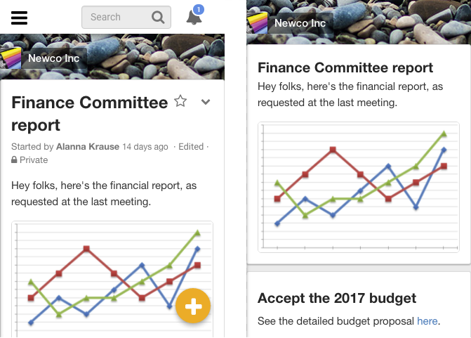

# Marketing tools

## Assets

You’ll find brand assets like screenshots, logos, and illustrations [in the Loomio brand assets folder](https://drive.google.com/open?id=0By3lxDcQiC3Oc29SYjA1MkVkXzA). Please keep these organised so we can quickly produce new marketing collateral - talk to Rich if you have questions.

Image files are named descriptively, including the width in pixels, like loomio-mobile-content_394.png

## Link tracking

To start with at least, we're going to be very granular with our link tracking. [This article](https://github.com/simontegg/marketing/wiki/Marketing-Analytics) is a good introduction to UTM link tracking. [This is the spreadsheet](https://docs.google.com/spreadsheets/d/1zP3jNePhTSzmDoTK2yHoQwdHxD5jyXN311IQli2JtPs/edit#gid=0) for building our UTM links:

The first page is the **content distribution link** generator. So when we have a new blog post, we'll use a unique link to share it on Facebook, and another one on Twitter.

The second page is the **internal link** generator. So the call to action at the bottom of the blog post will have this link on it.

This way we can run a single campaign across lots of different channels and see how they perform relative to each other.

In Google Analytics, go to Acquisition -> Campaigns -> All Campaigns to see how all the campaigns are performing.

## Unbounce for landing pages

We’re using Unbounce.com to build and test landing pages. A landing page is a single page that has all the information someone needs to make a purchase. It is targeted at a specific user with a specific problem.

If you skip 15 minutes [into this podcast](https://soundcloud.com/nextview/22-landing-pages-that-convert-oli-gardner-unbounce) you’ll get a great summary of the 5 critical elements of a successful landing page:

1. Specific and **unique value proposition**
2. **Hero shot** (photo or video showing the solution) relevant, contextualised, emotion, credible, persuasive
3. **Feature benefits** (couple sentences + couple bullets first, possibly more comprehensive feature details later)
4. **Social proof** (testimonials w/ very specific quotes)
5. **Call to action** (CTA)

CTAs link to "[https://www.loomio.org/start_group](https://www.loomio.org/start_group)" with the “[Pass through URL parameters](http://documentation.unbounce.com/hc/en-us/articles/203805714?_ga=1.147783351.1616129681.1468286578#content5)” option selected. This means we can put UTM's on our Facebook ad like `get.loomio.org/governance?utm_campaign=governance&utm_source=facebook`, and then the button on the landing page will link to `https://www.loomio.org/start_group?utm_campaign=governance&utm_source=facebook`

## Screenshots

Our landing pages feature screenshots of the app in use. To convey the meaning more succinctly, we remove extra UI elements, like the navbar and options menus. Like this:

*Screenshots before and after removing extra UI*

If you install the Stylish extension on [Chrome](https://chrome.google.com/webstore/detail/stylish/fjnbnpbmkenffdnngjfgmeleoegfcffe?hl=en) or [Firefox](https://addons.mozilla.org/en-US/firefox/addon/stylish/), you can then [run this custom stylesheet](https://userstyles.org/styles/130773/loomio-marketing-screenshots-active) to remove this extra UI.

If you open the Developer Tools in either of those browsers (opt+cmd+I), in Responsive Design Mode (cmd+shift+M in Chrome, cmd+opt+M in Firefox) you can configure the screen to a standard 320x480px size, so all your screenshots are the same size.

Many of us have a Retina screen, which has twice the pixel density of the a standard screen. This creates a lot of confusion. The Responsive Design screen tells you you’re looking at a 320px-wide screen, but if you’re on a Retina screen, there are actually 640 pixels there.

If you’re on a Retina Mac, OSX and Chrome’s built-in screenshot tools will both produce a 640px image, whereas Firefox’s screenshotter will make a 320px image.

If we use 640px images, we can be sure they’ll look good on Retina Macs, iPhones, iPads, and other high def screens.

Screenshots live in the [landing page screenshots folder](https://drive.google.com/open?id=0Bxr3iqrIRxyQSHYxYzRwb2w5Yms) in the Drive.

