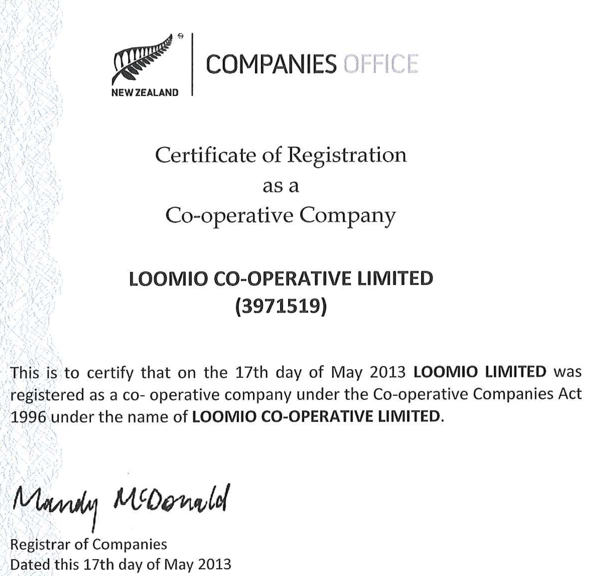

# Our Cooperative

In this section, you can find out [some of our history](history.html), and why we chose to incorporate as a worker-owned cooperative.

We have a [fierce commitment to our values](purpose_and_vision.html), which is reflected in all the choices we make, from the legal structure, to [our daily working practices](working_together.html), how we [look after our people](looking_after_people.html) and manage [employment and co-op membership](employment_and_membership.html), to financing.

For more on that topic, check this beautiful article from Nathan Schneider: [How a Worker-Owned Tech Startup Found Investors—and Kept Its Values](http://yesmagazine.org/new-economy/how-a-worker-owned-tech-startup-found-investors-and-kept-its-values-20160426).

