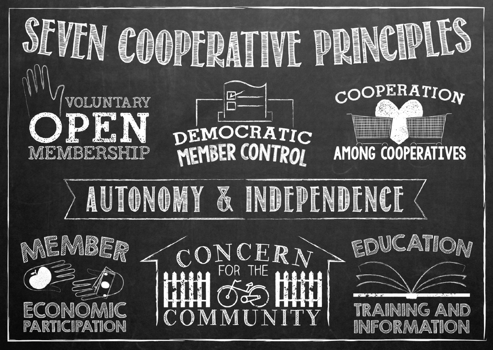

# Our Cooperative

Why we're a co-op, what it means

We decided that a co-op is the legal structure that best fits our values.

Ownership has an impact on your social mission

Aligned with open source company

We don't have traditional equity

Aligns incentives, mission, and stakeholding.

Link to Yes! magazine article about funding.

Our coop shares the [seven cooperative principles](http://faresharecoop.org/why-be-a-co-op.html):

## About Cooperatives & The Seven Principles
Much of the general content on this page has been directly borrowed from the [Cooperatives UK Worker Code repo](https://github.com/cooperativesuk/workercode/blob/master/SUMMARY.md#summary). 

### What is a worker cooperative?

Cooperatives apply the values of cooperation – autonomy, democracy, equality, equity and solidarity – in the workplace and in their communities. Worker co-operatives are trading enterprises, owned and run by the people who work in them, who have an equal say in what the business does, and an equitable share in the wealth created from the products and services they provide. As well as benefiting their members, co‑operatives act together to ‘build a better world through co-operation’.

*“Worker co-operatives have the objective of creating and maintaining sustainable jobs and generating wealth, in order to improve the quality of life of the worker-members, dignify human work, allow workers’ democratic self-management and promote community and local development.” (CICOPA/ICA, 2005.)*

### 1st Principle: Voluntary and open membership

Co‑operative membership is open to all workers able and willing to accept the responsibilities of membership. Worker co-operatives function best as an inclusive team of members with long-term collective interests in the success of the business.

Co-operatives should: 
1. Provide all workers with meaningful information about membership and how to join. 
2. Provide members with an agreed set of rights and responsibilities, usually as a member job description or membership agreement. 
3. Include a probationary period and membership training for workers who want to become members.
4. Offer membership to all workers who are able and willing to accept the responsibilities of membership. 
5. Ensure the majority of workers are members and the majority of members are workers.

### 2nd Principle: Democratic member control

Co-operatives are democratic organisations controlled by their members, setting policies and making decisions. Members serving as elected representatives are accountable to the wider membership. Worker co-operatives succeed when all members participate in transparent, fair decision making; but also where members are given delegated authority to act on behalf of the collective.

Co-operatives should: 
1. Ensure all members actively participate in the management of the business and long-term planning.
2. Effectively communicate, both between the co‑operative and its members and between members themselves.
3. Collectively agree and delegate authority to individual members to act on behalf of the co-operative as and where necessary.
4. Ensure there are democratic processes, or democratic accountability, in all governance and management functions. 
5. Regularly review its governance and business management processes as it grows and develops.

### 3rd Principle: Member economic participation

Members contribute equitably to, and democratically control, the capital and finances of their co-operative. Members decide how to use surpluses (profits). Worker co-operatives should provide the pay and other benefits that members need and want, managing the business to provide them and protect its future.

Co-operatives should: 
1. Allocate a percentage of surpluses to collectively owned financial reserves and capital.
2. Ensure that members are enabled to invest in the co-operative if they want to. If members have individual investments, they do not attract additional voting rights.
3. Have a planned and agreed pay and benefits structure, including non-financial benefits. 
4. Aim to offer pay and benefits sufficient to sustain long term employment and membership, to enable the co-operative to retain the required skills and experience. 
5. Ensure that any surplus in the form of pay and benefits is distributed fairly and equitably between members, relative to their contribution.
