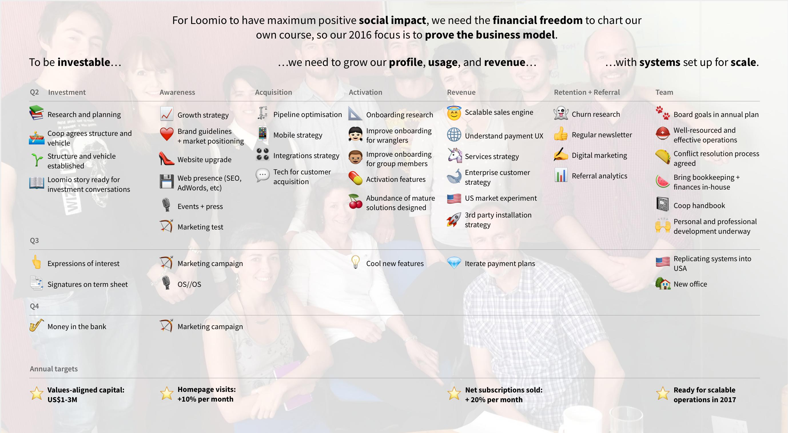

# Planning

we do annual planning so everyone is focussed on the same thing

For 2016, our annual planning process started with a day out of the office. Together we agreed what our focus would be for the year: the one thing that everyone is contributing to, regardless of their job.

We’ve always said that the best way we can deliver our social mission is to develop the financial freedom to chart our own course. So at our planning day we agreed that our focus for 2016 is on proving the business model.

We discussed how we can break this work up into streams, based on the groups of people we serve:

* we want to earn the confidence of values-aligned investors who will support our growth
* we want to reach out into the world to tell people about how we can help them organise inclusively and effectively
* we want to support our customers to use Loomio to make a positive impact in their workplaces and communities
* and we want to nurture our team of amazing humans to feel awesome in their work

We also set some specific targets to measure our progress, and named some of the big chunks of work we knew we’d have to do to get there. After the planning day, the coordinators facilitated a process to bring all this together into a budget and visual plan-on-a-page:

