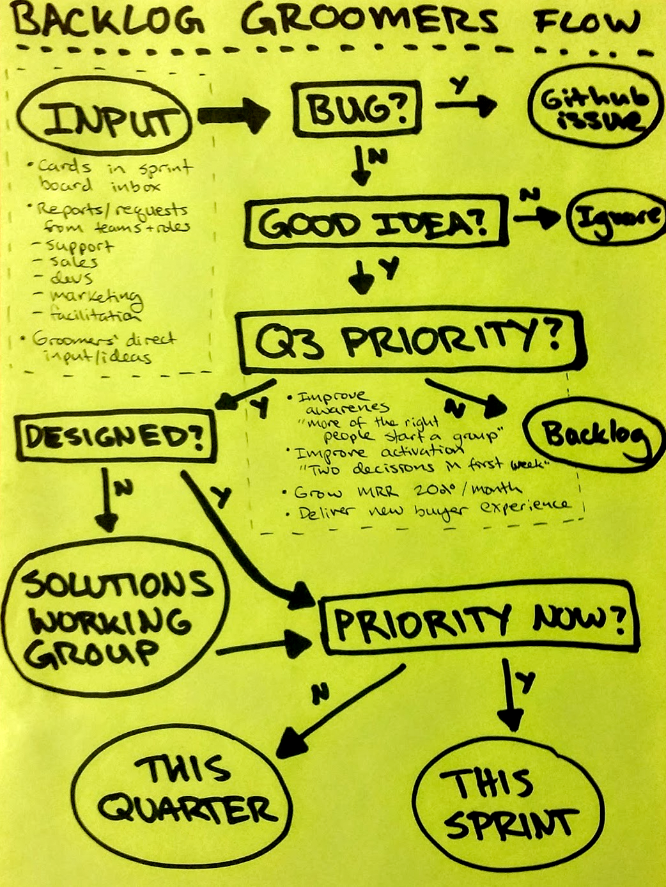

# Product Prioritisation

*How does Loomio decide what to build in the software?*

We use an Agile development process, so we have familiar functions like the product owner and backlog grooming. However, we tend to take a more distributed, collaborative approach to these methods.

### Backlog Groomers
The Groomers working group meets every other week, at the midpoint of the sprint, to review the backlog on our sprint board, process incoming feedback, and make decisions about what to ask the developers to spend their time working on.

The Groomers hear from various input sources, and try to maximise quality and diversity of feedback informing product prioritisation. These voices include customer support, our user community group, sales and marketing team, metrics and analytics, Loomio developers, facilitation experts, accessibility advisors, and the views of the team members.

Throughout the sprint, if anyone on the team has an idea or is offered one from a user or anyone, they create a card on the "inbox" list on the sprint board. The Groomers process these cards in their meetings.

The Groomers follow this decision-making flow, to prioritise cards according to our [quarterly plan](https://loomio.gitbooks.io/loomio-cooperative-handbook/content/planning.html).

### Solutions Working Group

The solutions working group is where problems go to become solutions. Often it's temping to identify an issue and jump straight to the first solution, but often it turns out that the problem is actually only one part of a larger issue, or is better solved with lateral thinking. Putting ideas through to be developed before they've been properly designed is a recipe for a bad user experience and frustrated coders. 

The team challenges itself to explain the evidence or experience of the problem clearly, without making too many assumptions before the design process can take place. After solutions have been designed, we consider them for development priority. While delivering a great new design is exciting, we try not to jump straight into building them without thinking about what other important things we might want to work on, too.

### Product Owner

The Loomio product owner is a role that occasionally rotates among team members. We generally select someone who has a particular skill or passion for how we have prioritised the product development focus.

The product owner's focus is keeping our product backlog in good shape, meaning it:

* is aligned with our agreed strategy expressed in annual & quarterly plans
* is appropriately informed by input from different areas of the business
* is full of well defined, designed & sized stories, that included our best guess about their hoped-for return on investment
* has an appropriate amount of space for experimentation and responsiveness

One key role of the product owner is to help everyone get their user stories well defined so we can do effective sprint planning. Another is making definitive calls if uncertainty about which way to go with a product decision is holding up the team. Of course, we always attempt to build consensus if people have different ideas, and the product owner facilitates this.

### Writing Good Stories

Anyone from the team can add a story to the Inbox (the first list on the Loomio Sprint Board).

A story is either a description of a problem, or a statement of value. At the very least a story should have a name, and 3 lines: “As a... I want to... So that I can...”.

Some other things you can include to make it a stronger contender for prioritisation:

* Evidence: “7 customers have asked about X this year”
* Effort to deliver: “This is a huge job”
* Value: “If we had this feature we’d make X sales”
* Risk: “If we don’t do it, we will be in big trouble”
* Opportunity cost: “Working on this means we won’t be working on this”
    

