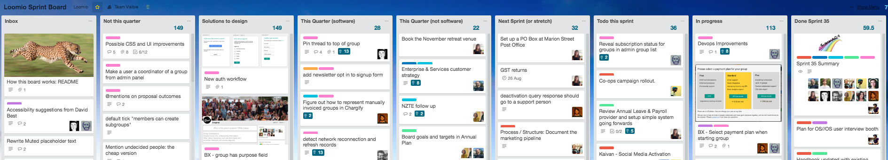

# Sprints

## we run two-week sprints to maintain agility

Like a lot of software companies, we use an agile software development process known as “scrum” to coordinate our work.

We break up the year into two-week chunks. Each chunk is called a sprint, though that is kind of a dumb name because it’s more about jogging at a sustainable pace, rather than sprinting as fast as we can and collapsing at some imaginary finish line.

### The Sprint Board

Probably the best way to understand it is to look at our sprint board on Trello:

**Inbox** is where you put stories that you think we should work on soon.

The [backlog groomers](product_prioritisation.html) get together fortnightly to consider these stories and decide if it is a priority (moving the card to **Next Up**) or not (**Backlog**).

The work for this Sprint is in the **To do this sprint** column. The whole team decides which stories to bring into each sprint at Sprint Planning on the first day of the sprint (every second Tuesday).

When someone is working on a ticket, we put their face on it and move it to **In Progress**.

At the top of the **Done** column is a **Sprint Summary** card. It includes our Sprint goals, notes about team Capacity, and the agenda for the Sprint Demo.

Our backlog is divided between **this quarter** and **not this quarter** so we can save good cards but not work on them straight away.

### Sprint Ceremonies

We have a day between sprints to use for planning and tying up loose ends. We find that investing time in good preparation makes the whole sprint process a lot smoother. On **prep day**, the team checks their outstanding Trello cards, reflects on what they want to prioritise in the upcoming sprint, and generally clears the decks to be ready for sprint planning.

**Sprint planning** happens on the first day of the sprint. Everyone comes to this meeting, where we agree sprint goals, check team capacity, agree which stories we’re going to take on, and identify risks. At the end of the meeting, we collectively commit to delivering all this work by the end of the sprint.

**Stand-up** happens every morning. It’s rapid fire, so everyone comes prepared with four pieces of information: what I did yesterday; what I'm doing today; any blocks that might stop me; and what I'm doing to look after my wellbeing today.

**Backlog grooming** happens in the middle of the sprint. It where we review all the cards on the board, process incoming feedback and  prioritise what to work on in the product. More details about this process [here](product_prioritisation.html).

**Sprint retrospective** is on the last day of the sprint. We reflect on how the last two weeks have been, and discuss any process improvements we want to focus on in the upcoming sprint.

**Sprint demo** is the last thing we do in the sprint. We get together to celebrate everything we completed over the past two weeks: working software, new designs, amazing customer stories we’ve heard, new policies, or any other finished work we want to share. Often, friends join us from outside the team who are interested to know what we're up to.
