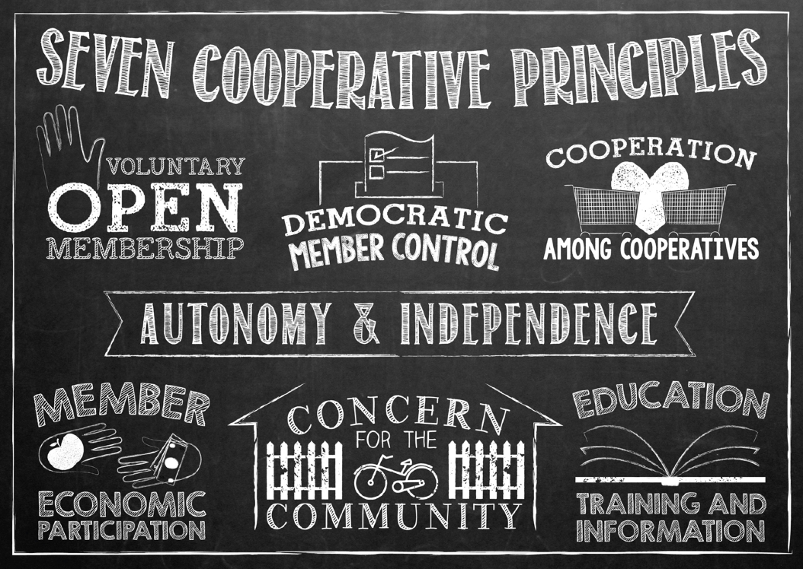

# Cooperative Principles

Our coop shares the seven cooperative principles:

*The content on this page has been gratefully borrowed from the [Worker Cooperative Code](https://github.com/cooperativesuk/workercode/blob/master/SUMMARY.md#summary). We are re-sharing it here for our co-op member and others, to support the 5th Principle: Education, training and information.* 

## What is a worker cooperative?

Cooperatives apply the values of cooperation – autonomy, democracy, equality, equity and solidarity – in the workplace and in their communities. Worker co-operatives are trading enterprises, owned and run by the people who work in them, who have an equal say in what the business does, and an equitable share in the wealth created from the products and services they provide. As well as benefiting their members, co‑operatives act together to ‘build a better world through co-operation’.

*“Worker co-operatives have the objective of creating and maintaining sustainable jobs and generating wealth, in order to improve the quality of life of the worker-members, dignify human work, allow workers’ democratic self-management and promote community and local development.” (CICOPA/ICA, 2005.)*

### 1st Principle: Voluntary and open membership

Co‑operative membership is open to all workers able and willing to accept the responsibilities of membership. Worker co-operatives function best as an inclusive team of members with long-term collective interests in the success of the business.

1. Provide all workers with meaningful information about membership and how to join. 
2. Provide members with an agreed set of rights and responsibilities, usually as a member job description or membership agreement. 
3. Include a probationary period and membership training for workers who want to become members.
4. Offer membership to all workers who are able and willing to accept the responsibilities of membership. 
5. Ensure the majority of workers are members and the majority of members are workers.

### 2nd Principle: Democratic member control

Co-operatives are democratic organisations controlled by their members, setting policies and making decisions. Members serving as elected representatives are accountable to the wider membership. Worker co-operatives succeed when all members participate in transparent, fair decision making; but also where members are given delegated authority to act on behalf of the collective.
 
1. Ensure all members actively participate in the management of the business and long-term planning.
2. Effectively communicate, both between the co‑operative and its members and between members themselves.
3. Collectively agree and delegate authority to individual members to act on behalf of the co-operative as and where necessary.
4. Ensure there are democratic processes, or democratic accountability, in all governance and management functions. 
5. Regularly review its governance and business management processes as it grows and develops.

### 3rd Principle: Member economic participation

Members contribute equitably to, and democratically control, the capital and finances of their co-operative. Members decide how to use surpluses (profits). Worker co-operatives should provide the pay and other benefits that members need and want, managing the business to provide them and protect its future.

1. Allocate a percentage of surpluses to collectively owned financial reserves and capital.
2. Ensure that members are enabled to invest in the co-operative if they want to. If members have individual investments, they do not attract additional voting rights.
3. Have a planned and agreed pay and benefits structure, including non-financial benefits. 
4. Aim to offer pay and benefits sufficient to sustain long term employment and membership, to enable the co-operative to retain the required skills and experience. 
5. Ensure that any surplus in the form of pay and benefits is distributed fairly and equitably between members, relative to their contribution.

### 4th Principle: Autonomy and independence

Co-operatives are independent, self-help organisations controlled by their members. If they raise capital from external sources, they must maintain their co-operative autonomy. Worker co-operatives should actively plan and manage their co-operative to be a successful business and avoid becoming over dependent on any funder, supplier or customer.

1. Have good financial controls and management, including cash flow forecasts and internal audits of all parts of the business. 
2. Actively manage and assign responsibilities for your operations, personnel, marketing and other business functions. 
3. Understand and control risks, both internal and external, facing your co-operative. 
4. Build your capability to identify and take advantage of business opportunities. 
5. Invest in equipment, premises and technology sufficient to achieve success.

### 5th Principle: Education, training and information

Co-operatives provide education and training for their members and employees so they can contribute effectively to the development of their co‑operative. They inform the general public about the nature and benefits of co-operation. Worker co-operative members should become multi-skilled, so they can participate fully in the management and development of the co-operative. 

1. Assess the technical, management and co‑operative skills needed to achieve your long term plans and replace key members who leave. 
2. Ensure all prospective members, members and elected representatives receive training in membership and co-operative skills. 
3. Encourage members in specialist roles to obtain technical skills and professional development for current and future needs. 
4. Develop and share management skills and techniques to permit efficient co-operative business co‑ordination. 
5. Educate business partners, customers and the public about the nature and benefits of co‑operative forms of business.

### 6th Principle: Co-operation amongst co-ops

Co‑operatives serve their members most effectively and strengthen the co-operative movement by working together through local, regional, national and international structures. 

1. Network with co‑operatives in your locality and industry to share intelligence, understand each others’ business needs and goals, and support each other. 
2. Trade with other co-operatives whenever possible. 
3. Find and refer new business opportunities to other co-operatives you know and trust. 
4. Collaborate with other co-operatives to achieve economies of scale, share costs, access to business opportunities and joint long-term development. 
5. Practice fair and honest commercial competition between co-operatives. 
6. Participate in regional and national co-operative activities to promote, develop and grow the co-operative economy.

### 7th Principle: Concern for community

Co-operatives work for the sustainable development of their communities, through working according to policies approved by their members. Co-operative businesses are rooted in community. By building good relations with your local and wider communities, you will create goodwill and opportunities for your co‑operative and members. 

1. Actively control the environmental and social impacts of your business. 
2. Agree and live up to ethical business standards. 
3. Operate high health and safety and worker welfare standards. 
4. Prioritise and promote ethical and sustainable initiatives, such as fair trade. 
5. Participate in your local, and wider, communities, and promote co-operative principles within them.