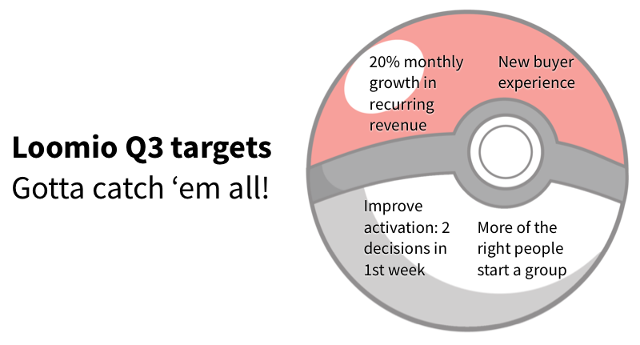

# Planning

## Annual

We do annual planning so everyone is focused on the same thing, and all the different areas of our work add up to a coherent and coordinated whole.

Our annual planning process starts with a day out of the office. Together we agree what our focus will be for the year.

### 2016 Plan

We’ve always said that the best way we can deliver our social mission is to develop the financial freedom to chart our own course. So we agreed that our focus for 2016 is **proving the business model**.

We discussed how we can break this work up into streams, based on the groups of people we serve:

* we want to earn the confidence of values-aligned **investors** who will support our growth
* we want to reach out into the **world** to tell people about how we can help them organise inclusively and effectively
* we want to support our **customers** to use Loomio to make a positive impact in their workplaces and communities
* and we want to nurture our **team** of amazing humans to feel awesome in their work

## Quarterly

Every quarter, we have an away day (preceded and followed by various preparation and workshops), where we take stock of where we are relative to our overall vision, annual plan, and emerging reality, and decide what to focus on for the coming 3 months. This allows us to update our understanding of our annual plan as we learn more, and the world changes, and adjust course accordingly.

Quarterly plans take a range of forms, depending on the circumstances and needs of the team. Usually we end up with a more in-depth document, accompanied by an easily accessible summary.

The goal is to provide a guiding focus for all our work across the team. Because we give individuals a lot of autonomy and don't micro-manage, we need to agree some themes and shared goals to have collective impact. If we try to do everything, we're likely to be distracted and stretched too thin. But we like to name ambitious goals to motivate ourselves.

## Away Days

### Pre-Away Day

* working groups convene and discuss what they accomplished that quarter, and what they've learned
* evidence, data, and metrics are gathered
* the coordinators write a quarterly report giving an assessment of how we did achieving our previous quarterly goals and where we're at with the overall plan
* everyone individually reflects on what happened over the quarter and what they think about upcoming priorities (sometimes informally, sometimes we send out a survey)

### Away Day (Offsite)

While we leave room for flexibility in the agenda and facilitation, this is a format we've generally found works for us.

* Arrive and have an extended check-in circle, with space for both personal and professional reflections from each person
* Context from the Coordinators, reviewing what happened in the last quarter and reminding us of the quarterly planning process and goals
* Dialogue circle on a relevant theme, to enable some deeper collective thinking
* Gather questions and discussion topics; clarify what we all need to feel resourced to set the upcoming quarterly priorities
* Co-create afternoon sessions, which can take a range of formats: open space, pair walks, whole group discussion, breakout small groups on specific topics
* Summarise, clarify next steps, and check out

### Post-Away Day

* Followup workshops to go deeper on topics that arose out of the away day, which are usually more detailed and elucidate a strategy or work plan for a specific area
* Coordinators synthesise the outcomes of the away day and reflect them back to the team
* Discuss and work toward agreeing the quarterly goals on officially on Loomio
* The team gets to work delivering our targets for the quarter
