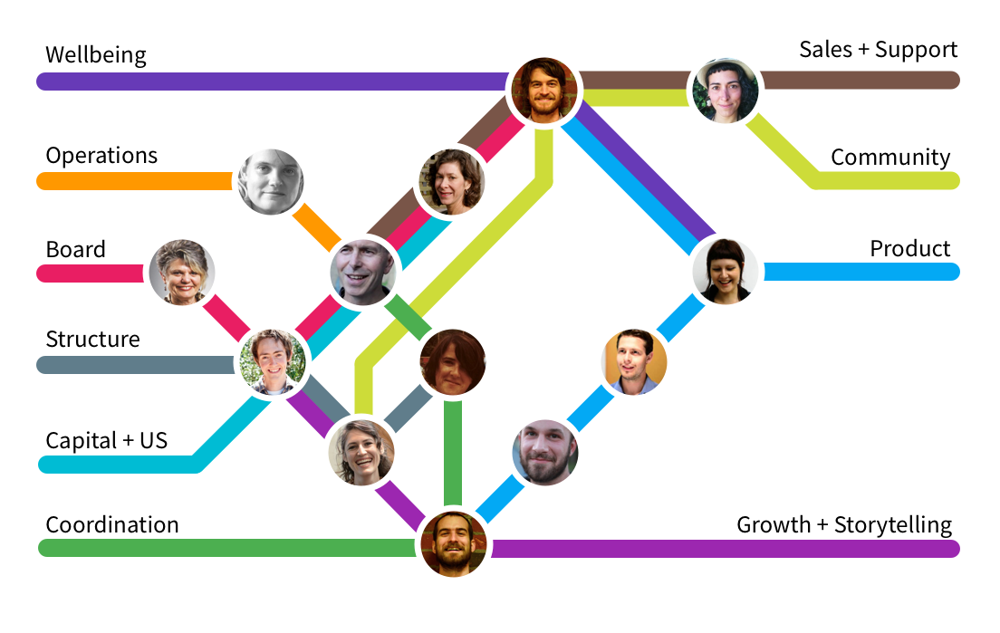

# Working Groups

The Loomio team tends to organise itself into working groups. These are emergent groups of people that form in response to the work at hand. We don't declare what working groups should exist - rather, we seek to notice them forming, to help name and support them. Joining a working group is a decision made by the worker themselves, not an assignment. 

While people do take on individual projects at Loomio, we generally find that "no teams of one" is a good mantra. As a collaborative organisation, we find people tend to work better if they have a crew taking collective responsibility with them.

Some working groups form to do a specific job, and then disband. An example of this was the "Loomio Community Working Group", which came together to develop good practice and guidelines for [how Loomio uses Loomio](using_loomio.html), reorganise our internal group structure, and improve how we engage with our wider community in public groups hosted by the Co-op. Once the new systems were in place, the group ceased to exist and its members moved on. 

Other times, working groups merge, split, or reorganise. For example, at one point the Capital and Strategy working groups merged, as did the Sales and Marketing groups. We generally review working groups as part of [quarterly planning](planning.html), or whenever the need for a change arises.

*Q4 2016 Working groups*

*Q3 2016 Working Groups*

*Q2 2016 Working groups*

Working groups are useful for several reasons:

* Clarity about roles - if you want to talk to someone about an area of work you aren't usually involved in, you know who to approach. Individuals also gain more clarity about what their portfolio of work at Loomio includes, and helps them focus their efforts.
* Decision-making delegation - the team knows that certain areas of work are being held by small groups of people, who are empowered to move forward without checking in with everyone else about the details.
* Rhythm - most working groups have a regular meeting time, and internal processes for deciding what to work on and how to deliver value. This helps continually move work forward.
* Specialist Expertise - people with a specific skill (like coding, design, governance, or strategy) can go deep on work in their area, and people can learn and grow their skills by taking on a type of work.

**Working Group Reporting Process**

One workflow we've found quite useful is to have a running "Updates" thread in our team's main Loomio group for each working group, where they report progress on an ongoing basis. These are usually high-level updates, so the rest of the team can stay in the loop without needing to attend any of their meetings or taking too much time. Most working groups also link to a shared document or folder of their group's notes, in case people want more detail. 

These Update threads also serve as a channel for the rest of the team to communicate to that group. They can leave questions, comments, or feedback, which the working group can take on board. So if someone not involved in marketing has a question about it, they know where to post it.

**Decision-making**

If a working group is taking on an issue that goes beyond their scope for empowered delegation and affects the whole team, they will facilitate a wider discussion and decision. Working groups research, gather background information, consult with experts, or whatever else is needed to frame the issue for the wider team. This often takes the form of hosting a Loomio discussion and decision, but can also include workshops, meetings, reports, or other processes. 

